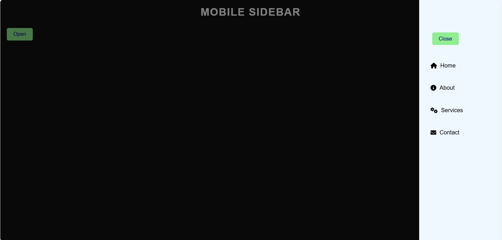

# Mobile Sidebar with Overlay Animation

A simple and responsive mobile sidebar menu with overlay animation, designed using HTML, CSS, and JavaScript. 



## Features

- **Slide-in Sidebar Animation**: The sidebar smoothly slides in from the right side.
- **Overlay Effect**: A dimmed overlay to focus on the sidebar when open.
- **Interactive Menu Items**: Each menu item includes an icon and hover effect.
- **Responsive Design**: Optimized for mobile screens and adaptable to different screen sizes.

## Project Structure

```plaintext
├── index.html       # HTML structure for the sidebar and overlay
├── style.css        # Styling for the sidebar, overlay, and main elements
└── script.js        # JavaScript functionality for open/close interactions

